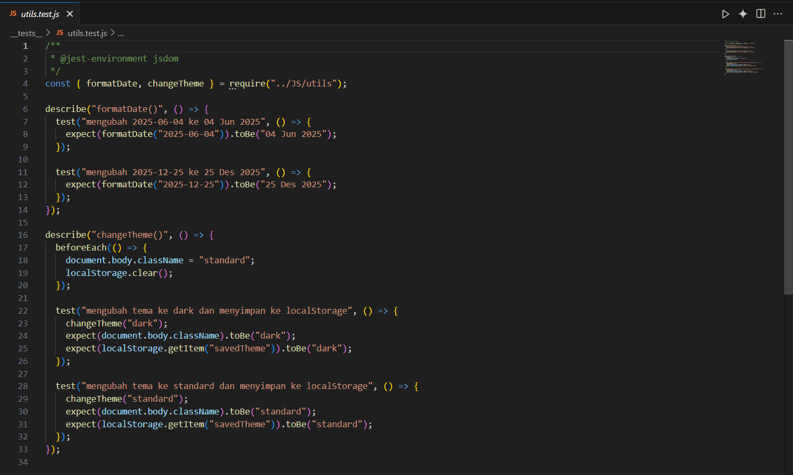
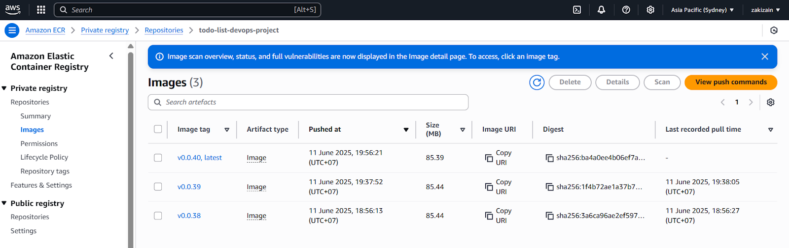
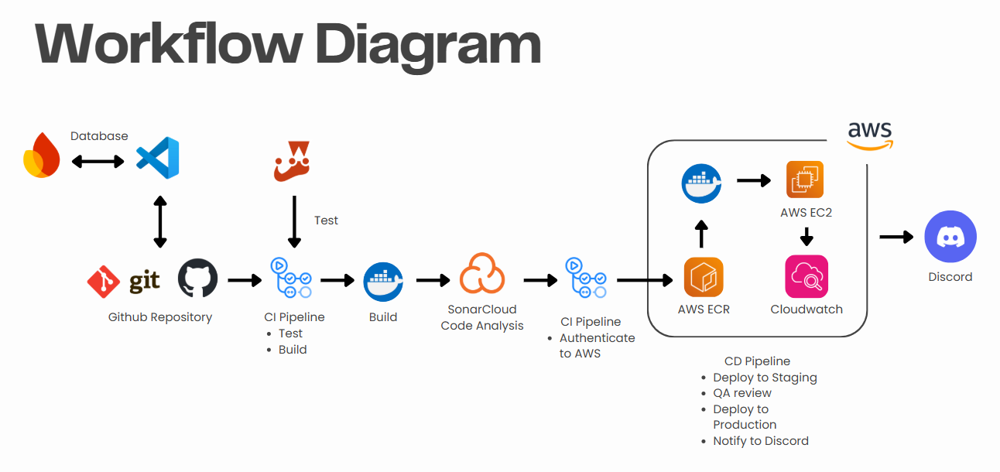

# 📝 Just List It.


## ❔ About:
Just List It is a straightforward web-based to-do list application developed with JavaScript. This project forks an open-source repository [Lordwill1/todo-list](https://github.com/Lordwill1/todo-list).

Its primary goal is to help users to record, manage, and complete their daily tasks. A key feature is that tasks details are stored securely within each user's individual account, including the deadline dates they have set, ensuring personalized and persistent access to their to-do lists.

To ensure rapid and reliable deployments, we implemented CI/CD for the project. It automatically builds the application, runs the unit tests, and deploys the app to the server.

This documentation will overview the project-making process, from forking a github repository until the feature-refinement stage, including the framework and tools used in the project, and also the explanation of the CI/CD Pipeline Workflow itself.

## 👥 Features:
* User Registration & Login
* Personalized to-do list manager
* Themes: Users can choose from several theme options
* Cloud-based storage

## 🛠 Tools Used:
### Tools Overview:
* **Frontend, Backend, and Database:**
   
   [](https://www.javascript.com/)
   [](https://nodejs.org/en)
   [-303030?style=for-the-badge&logo=firebase&logoColor=DD2C00&labelColor=FFFFFF&color=303030&link=https%3A%2F%2Ffirebase.google.com%2F)](https://firebase.google.com/)

* **Version Control:**
   
   [](https://github.com/)
* **CI/CD:**

   [](https://github.com/features/actions)

* **DevOps Supporting Tools:**
   
   [](https://www.docker.com/)
   [](https://jestjs.io/)
   [](https://sonarcloud.io/)
   [](https://discord.com/)
   [![AWS](https://img.shields.io/badge/AWS-orange?style=for-the-badge&labelColor=FFFFFF&logo=data:image/svg%2bxml;base64,PD94bWwgdmVyc2lvbj0iMS4wIiBlbmNvZGluZz0idXRmLTgiPz4NCjwhLS0gR2VuZXJhdG9yOiBBZG9iZSBJbGx1c3RyYXRvciAxOS4wLjEsIFNWRyBFeHBvcnQgUGx1Zy1JbiAuIFNWRyBWZXJzaW9uOiA2LjAwIEJ1aWxkIDApICAtLT4NCjxzdmcgdmVyc2lvbj0iMS4xIiBpZD0iTGF5ZXJfMSIgeG1sbnM9Imh0dHA6Ly93d3cudzMub3JnLzIwMDAvc3ZnIiB4bWxuczp4bGluaz0iaHR0cDovL3d3dy53My5vcmcvMTk5OS94bGluayIgeD0iMHB4IiB5PSIwcHgiDQoJIHZpZXdCb3g9IjAgMCAzMDQgMTgyIiBzdHlsZT0iZW5hYmxlLWJhY2tncm91bmQ6bmV3IDAgMCAzMDQgMTgyOyIgeG1sOnNwYWNlPSJwcmVzZXJ2ZSI+DQo8c3R5bGUgdHlwZT0idGV4dC9jc3MiPg0KCS5zdDB7ZmlsbDojMjUyRjNFO30NCgkuc3Qxe2ZpbGwtcnVsZTpldmVub2RkO2NsaXAtcnVsZTpldmVub2RkO2ZpbGw6I0ZGOTkwMDt9DQo8L3N0eWxlPg0KPGc+DQoJPHBhdGggY2xhc3M9InN0MCIgZD0iTTg2LjQsNjYuNGMwLDMuNywwLjQsNi43LDEuMSw4LjljMC44LDIuMiwxLjgsNC42LDMuMiw3LjJjMC41LDAuOCwwLjcsMS42LDAuNywyLjNjMCwxLTAuNiwyLTEuOSwzbC02LjMsNC4yDQoJCWMtMC45LDAuNi0xLjgsMC45LTIuNiwwLjljLTEsMC0yLTAuNS0zLTEuNEM3Ni4yLDkwLDc1LDg4LjQsNzQsODYuOGMtMS0xLjctMi0zLjYtMy4xLTUuOWMtNy44LDkuMi0xNy42LDEzLjgtMjkuNCwxMy44DQoJCWMtOC40LDAtMTUuMS0yLjQtMjAtNy4yYy00LjktNC44LTcuNC0xMS4yLTcuNC0xOS4yYzAtOC41LDMtMTUuNCw5LjEtMjAuNmM2LjEtNS4yLDE0LjItNy44LDI0LjUtNy44YzMuNCwwLDYuOSwwLjMsMTAuNiwwLjgNCgkJYzMuNywwLjUsNy41LDEuMywxMS41LDIuMnYtNy4zYzAtNy42LTEuNi0xMi45LTQuNy0xNmMtMy4yLTMuMS04LjYtNC42LTE2LjMtNC42Yy0zLjUsMC03LjEsMC40LTEwLjgsMS4zYy0zLjcsMC45LTcuMywyLTEwLjgsMy40DQoJCWMtMS42LDAuNy0yLjgsMS4xLTMuNSwxLjNjLTAuNywwLjItMS4yLDAuMy0xLjYsMC4zYy0xLjQsMC0yLjEtMS0yLjEtMy4xdi00LjljMC0xLjYsMC4yLTIuOCwwLjctMy41YzAuNS0wLjcsMS40LTEuNCwyLjgtMi4xDQoJCWMzLjUtMS44LDcuNy0zLjMsMTIuNi00LjVjNC45LTEuMywxMC4xLTEuOSwxNS42LTEuOWMxMS45LDAsMjAuNiwyLjcsMjYuMiw4LjFjNS41LDUuNCw4LjMsMTMuNiw4LjMsMjQuNlY2Ni40eiBNNDUuOCw4MS42DQoJCWMzLjMsMCw2LjctMC42LDEwLjMtMS44YzMuNi0xLjIsNi44LTMuNCw5LjUtNi40YzEuNi0xLjksMi44LTQsMy40LTYuNGMwLjYtMi40LDEtNS4zLDEtOC43di00LjJjLTIuOS0wLjctNi0xLjMtOS4yLTEuNw0KCQljLTMuMi0wLjQtNi4zLTAuNi05LjQtMC42Yy02LjcsMC0xMS42LDEuMy0xNC45LDRjLTMuMywyLjctNC45LDYuNS00LjksMTEuNWMwLDQuNywxLjIsOC4yLDMuNywxMC42DQoJCUMzNy43LDgwLjQsNDEuMiw4MS42LDQ1LjgsODEuNnogTTEyNi4xLDkyLjRjLTEuOCwwLTMtMC4zLTMuOC0xYy0wLjgtMC42LTEuNS0yLTIuMS0zLjlMOTYuNywxMC4yYy0wLjYtMi0wLjktMy4zLTAuOS00DQoJCWMwLTEuNiwwLjgtMi41LDIuNC0yLjVoOS44YzEuOSwwLDMuMiwwLjMsMy45LDFjMC44LDAuNiwxLjQsMiwyLDMuOWwxNi44LDY2LjJsMTUuNi02Ni4yYzAuNS0yLDEuMS0zLjMsMS45LTMuOWMwLjgtMC42LDIuMi0xLDQtMQ0KCQloOGMxLjksMCwzLjIsMC4zLDQsMWMwLjgsMC42LDEuNSwyLDEuOSwzLjlsMTUuOCw2N2wxNy4zLTY3YzAuNi0yLDEuMy0zLjMsMi0zLjljMC44LTAuNiwyLjEtMSwzLjktMWg5LjNjMS42LDAsMi41LDAuOCwyLjUsMi41DQoJCWMwLDAuNS0wLjEsMS0wLjIsMS42Yy0wLjEsMC42LTAuMywxLjQtMC43LDIuNWwtMjQuMSw3Ny4zYy0wLjYsMi0xLjMsMy4zLTIuMSwzLjljLTAuOCwwLjYtMi4xLDEtMy44LDFoLTguNmMtMS45LDAtMy4yLTAuMy00LTENCgkJYy0wLjgtMC43LTEuNS0yLTEuOS00TDE1NiwyM2wtMTUuNCw2NC40Yy0wLjUsMi0xLjEsMy4zLTEuOSw0Yy0wLjgsMC43LTIuMiwxLTQsMUgxMjYuMXogTTI1NC42LDk1LjFjLTUuMiwwLTEwLjQtMC42LTE1LjQtMS44DQoJCWMtNS0xLjItOC45LTIuNS0xMS41LTRjLTEuNi0wLjktMi43LTEuOS0zLjEtMi44Yy0wLjQtMC45LTAuNi0xLjktMC42LTIuOHYtNS4xYzAtMi4xLDAuOC0zLjEsMi4zLTMuMWMwLjYsMCwxLjIsMC4xLDEuOCwwLjMNCgkJYzAuNiwwLjIsMS41LDAuNiwyLjUsMWMzLjQsMS41LDcuMSwyLjcsMTEsMy41YzQsMC44LDcuOSwxLjIsMTEuOSwxLjJjNi4zLDAsMTEuMi0xLjEsMTQuNi0zLjNjMy40LTIuMiw1LjItNS40LDUuMi05LjUNCgkJYzAtMi44LTAuOS01LjEtMi43LTdjLTEuOC0xLjktNS4yLTMuNi0xMC4xLTUuMkwyNDYsNTJjLTcuMy0yLjMtMTIuNy01LjctMTYtMTAuMmMtMy4zLTQuNC01LTkuMy01LTE0LjVjMC00LjIsMC45LTcuOSwyLjctMTEuMQ0KCQljMS44LTMuMiw0LjItNiw3LjItOC4yYzMtMi4zLDYuNC00LDEwLjQtNS4yYzQtMS4yLDguMi0xLjcsMTIuNi0xLjdjMi4yLDAsNC41LDAuMSw2LjcsMC40YzIuMywwLjMsNC40LDAuNyw2LjUsMS4xDQoJCWMyLDAuNSwzLjksMSw1LjcsMS42YzEuOCwwLjYsMy4yLDEuMiw0LjIsMS44YzEuNCwwLjgsMi40LDEuNiwzLDIuNWMwLjYsMC44LDAuOSwxLjksMC45LDMuM3Y0LjdjMCwyLjEtMC44LDMuMi0yLjMsMy4yDQoJCWMtMC44LDAtMi4xLTAuNC0zLjgtMS4yYy01LjctMi42LTEyLjEtMy45LTE5LjItMy45Yy01LjcsMC0xMC4yLDAuOS0xMy4zLDIuOGMtMy4xLDEuOS00LjcsNC44LTQuNyw4LjljMCwyLjgsMSw1LjIsMyw3LjENCgkJYzIsMS45LDUuNywzLjgsMTEsNS41bDE0LjIsNC41YzcuMiwyLjMsMTIuNCw1LjUsMTUuNSw5LjZjMy4xLDQuMSw0LjYsOC44LDQuNiwxNGMwLDQuMy0wLjksOC4yLTIuNiwxMS42DQoJCWMtMS44LDMuNC00LjIsNi40LTcuMyw4LjhjLTMuMSwyLjUtNi44LDQuMy0xMS4xLDUuNkMyNjQuNCw5NC40LDI1OS43LDk1LjEsMjU0LjYsOTUuMXoiLz4NCgk8Zz4NCgkJPHBhdGggY2xhc3M9InN0MSIgZD0iTTI3My41LDE0My43Yy0zMi45LDI0LjMtODAuNywzNy4yLTEyMS44LDM3LjJjLTU3LjYsMC0xMDkuNS0yMS4zLTE0OC43LTU2LjdjLTMuMS0yLjgtMC4zLTYuNiwzLjQtNC40DQoJCQljNDIuNCwyNC42LDk0LjcsMzkuNSwxNDguOCwzOS41YzM2LjUsMCw3Ni42LTcuNiwxMTMuNS0yMy4yQzI3NC4yLDEzMy42LDI3OC45LDEzOS43LDI3My41LDE0My43eiIvPg0KCQk8cGF0aCBjbGFzcz0ic3QxIiBkPSJNMjg3LjIsMTI4LjFjLTQuMi01LjQtMjcuOC0yLjYtMzguNS0xLjNjLTMuMiwwLjQtMy43LTIuNC0wLjgtNC41YzE4LjgtMTMuMiw0OS43LTkuNCw1My4zLTUNCgkJCWMzLjYsNC41LTEsMzUuNC0xOC42LDUwLjJjLTIuNywyLjMtNS4zLDEuMS00LjEtMS45QzI4Mi41LDE1NS43LDI5MS40LDEzMy40LDI4Ny4yLDEyOC4xeiIvPg0KCTwvZz4NCjwvZz4NCjwvc3ZnPg0K&logoColor=white)](https://aws.amazon.com/console/)

### Github
Github is a web-based platform that uses Git as its version control system to manage source codes and track changes in a software development project.

This is the **master branch** of our Github repository:


And this is the **develop branch** of our Github repository:


### Github Actions
GitHub Actions is an automation feature provided by GitHub for **integrating and managing workflows** in software development. With GitHub Actions, developers can create, run, and automate tasks such as building, testing, deployment, and more, directly from the GitHub repository.

Pipeline Job Content:


Pipeline Execution:


### Docker
Docker is a software that helps in the development and DevOps process for testing or installing application software within isolated "containers" that have their own environments. In its implementation in DevOps, the software application we developed will be built inside a container that has the same environment as production.

The service run on Docker:


The Docker build result:


### Jest
Jest is a popular testing framework for JavaScript applications, primarily used for unit, integration, and end-to-end (E2E) testing in applications built with React, Node.js, and other JavaScript frameworks. Jest was developed by Facebook and is known for its ease of use and advanced features that simplify the testing process.

The jest unit tests are divided into 3 files, which are auth.test.js, main.test.js, and utils.test.js, as in this screenshot:




Our Jest testing result:


### SonarCloud
SonarCloud is a cloud-based SonarQube service used to automatically analyze source code to detect bugs, security vulnerabilities, and improve code quality. By using SonarCloud, our team will receive analytical information about our code quality, as well as suggestions, warnings, and alerts for any errors or bugs in our code.

Here is our SonarCloud analysis result: 


### Firebase
Firebase is a service provided by Google used as a NoSQL database storage. The Firebase features used are Authentication (Login and Register) and Firestore Database (to record the to-do lists for each account).

Firebase Authentication


Firestore Database


### Amazon Elastic Container Registry (ECR)
Amazon ECR is an AWS container registry service used to securely store and manage Docker images. In this CI/CD implementation, Docker images will be built and pushed to ECR using GitHub Actions.

Our Amazon ECR repository:


### Amazon Elastic Compute Cloud (EC2)
Amazon Elastic Compute Cloud (EC2) is used as a host server to run Docker containers that have been pushed to ECR. The deployment process is automated from the GitHub Actions pipeline using SSH and Docker Compose.

AWS EC2 functions include:
* Serving as the production application host.
* Pulling Docker images from ECR.
* Running containers with Docker Compose.

This is our EC2 instance:


### Amazon Cloudwatch
Amazon CloudWatch is used to monitor EC2 instance performance in real-time. CloudWatch will record various metrics such as CPU Utilization, Disk IO, and Network Traffic. Additionally, CloudWatch is configured to create alarms when CPU usage exceeds a certain threshold and send notifications via email (SNS).


### Discord Notifications
Discord is used as an automated notification medium for pipeline execution results. Discord webhooks are configured to receive notifications if the pipeline:
* Success -> displaying the commit, branch, and Docker image tag.
* Fails -> displaying the commit, branch, and error status.

This is a documentation of the Discord Notification:


## Process Steps
This section explains the steps involved in preparing each tool for this DevOps project.

### GitHub
1. Create a GitHub account at https://github.com/.
2. After creating an account, you can create a new repository.
3. Then, you can clone the created repository to your local machine.
4. After cloning, you can start developing the website.
5. Every feature created needs to apply best practices for branch and commit naming to ensure proper and organized version control. Each feature will have a backlog/issue, so developers will write code on that specific branch.
6. In the *todo-list-devops-project* project, we divided branches into two main parts: main (the branch that stores code ready for public release) and develop (a collection of branches containing code additions, modifications, and removals).
7. After the development phase on each feature branch, a pull request will be made to the main branch.

### Clone Github
To create the to-do list application, you can clone the repository:
```sh
git clone [https://github.com/luthfan-ap/todo-list-devops-project.git](https://github.com/luthfan-ap/todo-list-devops-project.git) 
cd todo-list
```

### Node.js
Simple backend applications can be created using Node.js services.
1. Ensure Node.js is installed locally.
2. Initialize the project with the command `npm init -y`.

### Github Actions
1. To use GitHub Actions, you can refer to the tutorial at: https://docs.github.com/en/actions/writing-workflows/quickstart
2. Create a `.github/workflows` folder in your repository.
3. Create a `.yml` file that contains the CI/CD pipeline.
4. In this project, there is one pipeline, `ci-cd.yml`.
5. The `ci-cd.yml` pipeline will run when there is a push or a pull request to the `main` branch. This pipeline will perform Jest tests, SonarCloud Scans, and use AWS ECR with Docker for deployment to AWS EC2. 

### Docker
1. The first step is to install Docker Desktop from https://www.docker.com/products/docker-desktop/.
2. After installing Docker Desktop, we need to configure the repository by creating files named `Dockerfile` and `compose.yml`. The `Dockerfile` consists of a set of commands for installation and creating the image initialized in `compose.yml`.
3. To create an environment for the Docker image, an `.env-example` file needs to be created as an `.env` template. The Dockerfile contains a command to copy `.env-example` to `.env`. This file will be used for environment configuration in the Docker image.
4. Next, we can start the CI/CD automation process in GitHub Actions, which already has a Docker container push stage.

### Jest
1.  **Install Node.js:**
    First, ensure Node.js is installed on your machine. You can download it from the official Node.js website.
    After installation, verify the installation by running the following commands in your terminal:
    ```bash
    node -v
    npm -v
    ```
2.  **Initialize Your Project:**
    Navigate to your project directory in the terminal and initialize a new Node.js project to create a `package.json` file.
    ```bash
    npm init -y
    ```
3.  **Install Jest:**
    Install Jest and add it as a development dependency to your project:
    ```bash
    npm install --save-dev jest
    ```
4.  **Add Test Script to `package.json`:**
    Edit your `package.json` file and add the `test` script under the `"scripts"` section:
    ```json
    "scripts": {
      "test": "jest"
    }
    ```
5.  **Prepare Your Test File:**
    Create a test file (e.g., `auth.test.js`, `main.test.js`, and utils.test.js) that contains your unit test functions.

6.  **Run Your Tests:**
    Execute your tests using npm:
    ```bash
    npm test
    ```
    Jest will run all test files in your project (by default, files ending with `.test.js`, `.spec.js`, or files in a `__tests__` directory).

### SonarCloud
1. Go to the SonarCloud website: https://www.sonarsource.com/products/sonarcloud/.
2. Log in to your account using your GitHub account.
3. Click on *Profile* > *My Accounts* > *Security*, then generate a new token and save it.
4. Open your GitHub profile > settings > developer settings > personal access token, then generate a new token. Allow the necessary permissions for this token and save it.
5. Open your GitHub repository, go to settings > secrets & variable > action. Then create new secret variables named `SONAR_TOKEN` and `GIT_TOKEN`, and enter the saved tokens as their values.
6. Set up SonarCloud Scan in the GitHub Actions pipeline.

### Firebase
1. Set up your Firebase Project
   * Go to [Firebase Console](console.firebase.google.com).
   * Click "Create a Firebase Project" and follow the prompts to create a new project.
   * Once created, select your new project from the Firebase dashboard.
2. Register your Web App
   * In your Firebase Console, click the web (“</>”) icon to register a new web app.
   * Enter an app nickname (e.g., "Just List It App"), and click Register app.
   * You will be shown your Firebase SDK config (apiKey, authDomain, etc). Copy this config — you will use it in your project (usually in script.js).
3. Enable Firebase Authentication
   * In your Firebase Console sidebar, go to Build > Authentication.
   * Click "Get started".
   * In the Sign-in method tab, enable Email/Password authentication (or any other methods you want).
   * Save your changes.
4. Enable Firestore Database
   * In the sidebar, click Build > Firestore Database.
   * Click "Create database".
   * Select Start in test mode (recommended for development).
      > You can update security rules for production later.
   * Choose your database location (any is fine for most use cases) and click Next until done.
5. Add Firebase SDKs to your project
   * In your main HTML file (e.g., index.html), add these scripts before your main JavaScript files:
     ```sh
     <!-- Firebase App (core SDK) -->
     <script src="https://www.gstatic.com/firebasejs/10.11.1/firebase-app-compat.js"></script>
     <!-- Firebase Authentication -->
     <script src="https://www.gstatic.com/firebasejs/10.11.1/firebase-auth-compat.js"></script>
     <!-- Firebase Firestore -->
     <script src="https://www.gstatic.com/firebasejs/10.11.1/firebase-firestore-compat.js"></script>
     ```
6. Initialize Firebase in your code
   * In your JavaScript file (e.g., script.js), paste the config you copied earlier:
     ```sh
     const firebaseConfig = {
        apiKey: "YOUR_API_KEY",
        authDomain: "YOUR_PROJECT_ID.firebaseapp.com",
        projectId: "YOUR_PROJECT_ID",
        storageBucket: "YOUR_PROJECT_ID.appspot.com",
        messagingSenderId: "YOUR_SENDER_ID",
        appId: "YOUR_APP_ID"
     };
     // Initialize Firebase
     firebase.initializeApp(firebaseConfig);
     ```
7. Using Authentication and Firestore
   * Use firebase.auth() for authentication methods (register, login, logout, etc).
   * Use firebase.firestore() to read/write to Cloud Firestore.
     ```sh
     const db = firebase.firestore();
     const user = firebase.auth().currentUser;
     
     db.collection("todos").add({
        uid: user.uid,
        text: "My task",
        date: "2024-06-01",
        createdAt: firebase.firestore.FieldValue.serverTimestamp()
     });
     ```

### AWS Identity and Access Management (IAM)

#### Step 1: Create the IAM User

1.  Open the AWS Console and log in to your AWS account.
2.  In the service search bar at the top, type "IAM" and select the IAM service.
3.  In the left-hand navigation pane, click "Users".
4.  Click the "Add users" button.
5.  On the "Set user details" page:
    * Provide an easily recognizable "User name," for example, `github-actions-ecr-user` or `todo-list-cicd-user`.
    * Under "Select AWS access type," choose "Access key - Programmatic access." This is crucial as GitHub Actions will use an Access Key ID and Secret Access Key for authentication, not console login.
    * Click "Next: Permissions".

#### Step 2: Grant Permissions to the IAM User

1.  On the "Set permissions for user" page:
    * Select the "Attach existing policies directly" option.
    * In the policy search bar (filter policies), type `AmazonEC2ContainerRegistryPowerUser`.
    * Check the box next to the `AmazonEC2ContainerRegistryPowerUser` policy.
    * **Note:** This policy grants fairly broad permissions for ECR (creating repositories, pushing/pulling images, etc.). For stricter production environments, you can create a custom policy more specific to `ecr:GetAuthorizationToken`, `ecr:BatchCheckLayerAvailability`, `ecr:InitiateLayerUpload`, `ecr:UploadLayerPart`, `ecr:CompleteLayerUpload`, and `ecr:PutImage`. However, for initial setup, this is sufficient.
    * Click "Next: Tags" (this step is optional; you can add tags if needed for organization or cost management).
    * Click "Next: Review".

#### Step 3: Review and Create the IAM User

1.  On the "Review" page:
    * Carefully check the user details and the permissions that will be granted.
    * Click the "Create user" button.

#### Step 4: Obtain Access Credentials (Access Key ID and Secret Access Key)

1.  After the user is successfully created, you will see a "Success" page displaying the Access key ID and Secret access key.
2.  **Crucially Important:** This is your *only* opportunity to view the Secret access key. Copy both of these values immediately! You will not be able to retrieve this Secret access key again once you leave this page.
3.  Store both of these values in a secure place.


### AWS Elastic Container Registry (ECR)

1.  **Create an AWS Account**
    Visit https://aws.amazon.com and create an AWS account if you don't have one yet.

2.  **Create an ECR Repository**
    Open the AWS Console and navigate to the Elastic Container Registry service.
    Click the "Create repository" button.
    Name the repository (e.g., `todo-list-app`) and choose "Private" visibility.
    Click "Create repository".

3.  **Get Login Credentials**
    Run the following command to log in to ECR:
    ```bash
    PS C:\WINDOWS\system32> D:
    PS D:\> cd D:\todolist\todo-list-devops-project
    PS D:\todolist\todo-list-devops-project> icacls.exe "aws-docker-jenkins-server-key.pem" /reset
    aws-docker-jenkins-server-key.pem: The system cannot find the file specified.
    Successfully processed files; Failed processing 1 files
    PS D:\todolist\todo-list-devops-project> icacls.exe "todolist-server-key.peer" /reset
    processed file: todolist-server-key.pem
    Successfully processed 1 files; Failed processing files
    PS D:\todolist\todo-list-devops-project> icacls.exe "todolist-server-key.pem"/grant:r "$(Senv:username):( )"
    processed file: todolist-server-key.pem
    Successfully processed 1 files; Failed processing files
    PS D:\todolist\todo-list-devops-project> icacls.exe "todolist-server-key.per" /inheritance:r
    processed file: todolist-server-key.pem
    Successfully processed 1 files; Failed processing e files
    PS D:\todolist\todo-list-devops-project> ssh -i "todolist-server-key.pem" ubuntu@ec2-3-27-161-182.ap-southeast-2.compute amazonaws.com
    The authenticity of host 'ec2-3-27-161-182.ap-southeast-2.compute.amazonaws.com (3.27.161.182) can't be established.
    ED25519 key fingerprint is SHA256:hnfvLTs43WFDdIi01pWeO+TiuVMCgXyk8WNnNeQEESE.
    This key is not known by any other names.
    Are you sure you want to continue connecting (yes/no/[fingerprint])? yes
    Warning: Permanently added 'ec2-3-27-161-182.ap-southeast-2.compute.amazonaws.com (ED25519) to the list of known hosts.
    Welcome to Ubuntu 24.84.2 LTS (GNU/Linux 6.8.0-1024-aws x86_64)
    Documentation:
    [https://help.ubuntu.com](https://help.ubuntu.com)
    ```

4.  **Add Configuration to GitHub Actions**
    Add `AWS_ACCESS_KEY_ID`, `AWS_SECRET_ACCESS_KEY`, and `AWS_REGION` to GitHub Secrets.
    Add steps in GitHub Actions to:
    Log in to ECR.
    Build and tag the image.
    Push the image to the ECR repository:

    ```yaml
    # BUILD DOCKER IMAGE
    name: Configure AWS credentials
    uses: aws-actions/configure-aws-credentials@v1
    with:
      aws-access-key-id: ${{ secrets.AWS_ACCESS_KEY_ID }} 
      aws-secret-access-key: ${{ secrets.AWS_SECRET_ACCESS_KEY }} 
      aws-region: ap-southeast-2 

    # ... (rest of the build steps) ...

    # PUSH IMAGE TO ECR (give "latest" tag and push to AWS ECR) 
    name: Push Docker Image to Amazon ECR 
    id: set-image-uri 
    env:
      ECR_REGISTRY: ${{ steps.login-ecr.outputs.registry }} 
      ECR_REPOSITORY: todo-list-devops-project 
      IMAGE_TAG: ${{ steps.next_version.outputs.tag }} 
    run: |
      #Tag the image as latest
      docker tag $ECR_REGISTRY/$ECR_REPOSITORY:$IMAGE_TAG $ECR_REGISTRY/$ECR_REPOSITORY:latest 
      #Push the specific version tag
      docker push $ECR_REGISTRY/$ECR_REPOSITORY:$IMAGE_TAG 
      #Push the latest tag
      docker push $ECR_REGISTRY/$ECR_REPOSITORY:latest 
      # Construct the full ECR Image URI and set it as an output of this step
      FULL_ECR_IMAGE_URI="$ECR_REGISTRY/$ECR_REPOSITORY:$IMAGE_TAG" 
      echo "ECR Image URI: $FULL_ECR_IMAGE_URI" 
      echo "::set-output name=full_image_uri::$FULL_ECR_IMAGE_URI" # Set output for this step 
    ```

### AWS Elastic Compute Cloud

1.  **Create an AWS Account**
    
    If you don't have an AWS account, please register first at https://aws.amazon.com/.

2.  **Create an EC2 Instance**
    
    Log in to the AWS Management Console.
    Search for and select the "EC2" service.
    Click "Launch Instance".
    Choose an Amazon Machine Image (AMI), such as Ubuntu Server 22.04.
    Select an instance type, for example: t2.micro (free in the Free tier).
    Create a new key pair or choose an existing one, then download the `.pem` file.
    Configure the security group, ensuring ports 22 (SSH), 80 (HTTP), and 443 (HTTPS) are open if needed.
    Launch the instance.

3.  **Access EC2 Instance**
    
    Change key file permissions for security:
    ```bash
    chmod 400 your-key.pem
    ```
    SSH into the instance:
    ```bash
    sshi your-key.pem ubuntu@<Public-IP-EC2>
    ```

4.  **Install Docker and Docker Compose**
    
    After logging into EC2:
    ```bash
    sudo apt update 
    sudo apt install docker.io docker-compose -y 
    sudo systemctl start docker 
    sudo systemctl enable docker 
    sudo usermod -aG docker ubuntu 
    No VM guests are running outdated hypervisor (qemu) binaries on this host. 
    ubuntu@ip-172-31-8-39:~$ sudo docker run hello-world 
    Unable to find image 'hello-world:latest' 
    latest: Pulling from library/hello-world 
    e6590344b1a5: Pull complete 
    locally 
    Digest: sha256:dd01f97f252193ae3210da231b1dca@cffab4aadb3566692d6730bf93f123a48 
    Status: Downloaded newer image for hello-world:latest 
    Hello from Docker! 
    This message shows that your installation appears to be working correctly. 
    To generate this message, Docker took the following steps: 
    1. The Docker client contacted the Docker daemon. 
    2. The Docker daemon pulled the "hello-world" image from the Docker Hub. 
    (amd64) 
    3. The Docker daemon created a new container from that image which runs the 
    executable that produces the output you are currently reading. 
    4. The Docker daemon streamed that output to the Docker client, which sent it 
    to your terminal. 
    To try something more ambitious, you can run an Ubuntu container with: 
    $ docker run -it ubuntu bash 
    Share images, automate workflows, and more with a free Docker ID: 
    [https://hub.docker.com/](https://hub.docker.com/) 
    For more examples and ideas, visit: 
    [https://docs.docker.com/get-started/](https://docs.docker.com/get-started/) 
    ```

5.  **Get Docker Image from ECR**
    
    Configure AWS CLI on EC2:
    ```bash
    aws configure 
    ```
    Enter AWS Access Key, Secret Key, Region, and output format.
    Log in to ECR:
    ```bash
    aws ecr get-login-password --region <your-region> | docker login --username AWS --password-stdin <aws_account_id>.dkr.ecr.<region>.amazonaws.com 
    ```
    Pull image from ECR:
    ```bash
    docker pull <aws_account_id>.dkr.ecr.<region>[.amazonaws.com/](https://.amazonaws.com/)<repository-name>:<tag> 
    ```

6.  **Run Container**
    
    Run the container with Docker:
    ```bash
    docker run -d -p 80:8080 <image-uri> 
    ```
    Replace `8080` with the port inside the container as needed.

7.  **Access the Application**
    
    Open your browser and access the application using the EC2 public IP:
    ```
    http://<Public-IP-EC2> 
    ```

## CI/CD Pipeline Explanation

1.  **GitHub Action Workflow Configuration**
    ```yaml
    name: CI-CD Pipeline 
    on: 
      push: 
        branches: 
          # only on push to the master branch 
          - master 
      pull_request: 
        branches: 
          # only on pull request to the master branch 
          - master 
    ```
    The code above explains the workflow pipeline configuration named CI-CD Pipeline, which will automatically run when there is a pull request from the `develop` branch to `master` and when a push is made to the `master` branch.

2.  **`ci-cd-pipeline` Jobs Configuration**
    ```yaml
    jobs: 
      ci-cd-pipeline: 
        runs-on: ubuntu-latest 
        outputs: 
          ecr_image_uri: ${{ steps.set-image-uri.outputs.full_image_uri }} 
    ```
    This CI/CD pipeline runs using the latest version of Ubuntu (`ubuntu-latest`). The output of these jobs will produce `ecr_image_uri`, which will be taken from the output of the `set-image-uri` step named `full_image_uri`. This output is typically used if other jobs need to know the URI of the Docker image that has been built and pushed.

3.  **Checkout the Repository Step**
    ```yaml
    steps: 
    - name: Check out the repo 
      uses: actions/checkout@v2 
      with: 
        fetch-depth: 0 # Necessary to fetch all tags and history 
    ```
    This step downloads the source code from the GitHub repository to the runner using GitHub Action `checkout` version 2. `fetch-depth: 0` ensures that all Git history and tags are downloaded. This is important for subsequent steps that might depend on tags or commit history (such as determining the next version).

4.  **Setup Node.js for Jest Unit Test & Run Unit Test Step**
    ```yaml
    - name: Setup Node.js for tests 
      uses: actions/setup-node@v3 
      with: 
        node-version: '18' # IMPORTANT: Specify your Node.js version 
        cache: 'npm' 
    - name: Install dependencies for tests 
      run: npm ci # Use npm ci for clean installs in CI environments 
    - name: Run Jest tests 
      run: npm test 
    - name: Run tests with coverage 
      run: | 
        npm run test --coverage 
    ```
    This step installs the necessary Node.js environment with the specified version (18). NPM caching is used for npm dependencies to speed up execution time in subsequent runs. After that, the pipeline will install all required packages or libraries for the project and then run the `npm ci` command. This command ensures a clean and consistent installation based on `package-lock.json`, which is ideal for CI/CD environments. The "Run Jest tests" step functions to execute unit testing or integration using Jest by calling or running `npm test`.

5.  **Run Tests with Coverage Step**
    ```yaml
    - name: Run tests with coverage 
      run: 
        npm run test --coverage 
    ```
    "Run tests with coverage" aims to run unit testing and generate a code coverage report. `npm run test --coverage` will run the tests again, but with the `--coverage` flag to generate the code coverage report. This report is important for code analysis tools like SonarCloud.

6.  **SonarCloud Step**
    ```yaml
    # SONARCLOUD SCANNER 
    - name: SonarCloud Scan 
      uses: SonarSource/sonarcloud-github-action@v2 
      with: 
        args: > 
          -Dsonar.projectKey=luthfan-ap_todo-list-devops-project 
          -Dsonar.organization=pso-a-kelompok-7 
          -Dsonar.javascript.lcov.reportPaths=coverage/lcov.info 
          -Dsonar.exclusions=**/*.tf,**/*.tfvars,.terraform/** 
      env: 
        SONAR_TOKEN: ${{ secrets.SONAR_TOKEN }} 
    ```
    The purpose of this step is to perform static analysis on the source code to detect bugs, security vulnerabilities, and code smells, as well as to improve overall code quality. The arguments provided include `sonar.projectKey` (`luthfan-ap_todo-list-devops-project`) and `sonar.organization` (`pso-a-kelompok-7`).
    Additionally, `sonar.javascript.lcov.reportPaths` is directed to `coverage/Icov.info` to integrate code coverage results from previous steps. Authentication credentials (`SONAR_TOKEN`) are retrieved from GitHub Secrets.

7.  **Determine Next Version Step**
    ```yaml
    # DETERMINE NEXT VERSION (to create a new release version) 
    - name: Determine Next Version 
      id: next_version 
      run: | 
        #Fetch all tags 
        git fetch --tags 
        #Get the latest tag, assume semver, and sort. 
        LATEST_TAG=$(git tag -l | grep -E "v[0-9]+\.[0-9]+\.[0-9]+" | sort -V | tail -n1) 
        #If there's no tag yet, start with v0.0.0. Used for new repos 
        if [ -z "$LATEST_TAG" ]; then 
          LATEST_TAG="v0.0.0" 
        fi 
        #Increment the patch version 
        NEXT_TAG=$(echo $LATEST_TAG | awk -F. '{$3=$3+1; print $1"."$2"."$3}') 
        #Output the next version 
        echo "::set-output name=tag::$NEXT_TAG" 
        echo "Next version: $NEXT_TAG" 
    ```
    This step automatically determines the next release version number based on existing Git tags, following the Semantic Versioning (SemVer) standard. This step fetches all tags, identifies the latest version tag (e.g., VX.Y.Z), and then increments the patch version (e.g., v1.0.0 becomes v1.0.1). If no previous tags exist, the version will start from v0.0.0. The output of this step (`next_version.outputs.tag`) will be used for naming releases and Docker images.

8.  **Create Release Step**
    ```yaml
    # CREATE RELEASE (using the previous tag and versioning) 
    - name: Create Release 
      id: create_release 
      uses: actions/create-release@v1 
      env: 
        GITHUB_TOKEN: ${{ secrets.ACCESS_TOKEN_2 }} 
      with: 
        tag_name: ${{ steps.next_version.outputs.tag }} 
        release_name: Release ${{ steps.next_version.outputs.tag }} 
        draft: false 
        prerelease: false 
    ```
    This step creates a new release in the GitHub repository with the version tag determined in the previous step. It uses the `actions/create-release@vl` action. `tag_name` and `release_name` are set based on the output from the "Determine Next Version" step. The release will be published (`draft: false`, `prerelease: false`). The `GITHUB_TOKEN` credentials are used from GitHub Secrets (`ACCESS_TOKEN_2`).

9.  **Build Docker Image Step**
    ```yaml
    # BUILD DOCKER IMAGE 
    - name: Configure AWS credentials 
      uses: aws-actions/configure-aws-credentials@v1 
      with: 
        aws-access-key-id: ${{ secrets.AWS_ACCESS_KEY_ID }} 
        aws-secret-access-key: ${{ secrets.AWS_SECRET_ACCESS_KEY }} 
        aws-region: ap-southeast-2 

    - [cite_start]name: Login to Amazon ECR 
      [cite_start]id: login-ecr 
      uses: aws-actions/amazon-ecr-login@v1 

    - [cite_start]name: Extract repository name 
      [cite_start]id: repo-name 
      run: | 
        REPO_NAME="${GITHUB_REPOSITORY##*/}" 
        echo "REPO_NAME=$REPO_NAME" >> $GITHUB_ENV 
        echo "::set-output name=repo_name::$REPO_NAME" 

    - [cite_start]name: Build Docker image 
      [cite_start]env: 
        ECR_REGISTRY: ${{ steps.login-ecr.outputs.registry }} 
        ECR_REPOSITORY: ${{ steps.repo-name.outputs.REPO_NAME }} 
        IMAGE_TAG: ${{ steps.next_version.outputs.tag }} 
      run: | 
        docker build -t $ECR_REGISTRY/$ECR_REPOSITORY:$IMAGE_TAG 
        echo "IMAGE_NAME=$ECR_REGISTRY/$ECR_REPOSITORY:$IMAGE_TAG" >> $GITHUB_ENV 
    ```
    We now enter the CD Pipeline stage, where we will build the Docker image. 
    
    First, we configure AWS credentials in the runner environment to interact with AWS, especially Amazon ECR. The next step is "Login to Amazon ECR". This pipeline step will authenticate to Amazon ECR so that Docker images can be pushed or pulled from that repository.
    
    This step extracts the repository name from the GitHub Actions environment variable. It uses a shell command to get the repository name from `GITHUB_REPOSITORY` (e.g., `owner/repo-name` becomes `repo-name`) and sets it as a step output.
    
    After that, we can finally build the Docker image. This step will build a Docker image from the Dockerfile in the repository by running the `docker build` command. The image will be tagged with a combination of the ECR registry, repository name, and the previously generated version tag (`${{ steps.next_version.outputs.tag }}`).

10. **Push Docker Image to Amazon ECR Step**
    ```yaml
    # PUSH IMAGE TO ECR (give "latest" tag and push to AWS ECR) 
    - name: Push Docker image to Amazon ECR 
      id: set-image-uri 
      env: 
        ECR_REGISTRY: ${{ steps.login-ecr.outputs.registry }} 
        ECR_REPOSITORY: todo-list-devops-project 
        IMAGE_TAG: ${{ steps.next_version.outputs.tag }} 
      run: | 
        #Tag the image as latest 
        docker tag $ECR_REGISTRY/$ECR_REPOSITORY:$IMAGE_TAG $ECR_REGISTRY/$ECR_REPOSITORY:latest 
        #Push the specific version tag 
        docker push $ECR_REGISTRY/$ECR_REPOSITORY:$IMAGE_TAG 
        #Push the latest tag 
        docker push $ECR_REGISTRY/$ECR_REPOSITORY:latest 
        # Construct the full ECR Image URI and set it as an output of this step 
        FULL_ECR_IMAGE_URI="$ECR_REGISTRY/$ECR_REPOSITORY:$IMAGE_TAG" 
        echo "ECR Image URI: $FULL_ECR_IMAGE_URI" 
        echo "::set-output name=full_image_uri::$FULL_ECR_IMAGE_URI" # Set output for this step 
    ```
    This step pushes the built Docker image to Amazon ECR. The image will be given two tags: one with the specific version and another with the `latest` tag. This step uses the `docker tag` command to create the `latest` tag and `docker push` to push both tags to ECR.

11. **Deploy to EC2 Step**
    ```yaml
    # DEPLOYMENT TO EC2 
    - name: Deploy to EC2 
      uses: appleboy/ssh-action@master # Example action, might vary
      with:
        host: ${{ secrets.EC2_HOST }} 
        username: ${{ secrets.EC2_USER }} 
        key: ${{ secrets.EC2_KEY }} 
        script: |
          ECR_REGISTRY=${{ steps.login-ecr.outputs.registry }}
          ECR_REPOSITORY=todo-list-devops-project
          IMAGE_TAG=${{ steps.next_version.outputs.tag }}
          #Save PEM key to file and set permissions
          echo "${{ secrets.EC2_KEY }}" > ec2.pem 
          chmod 400 ec2.pem 
          #Login to Docker registry
          ssh -i ec2.pem -o StrictHostKeyChecking=no ${{ secrets.EC2_USER }}@${{ secrets.EC2_HOST }} "aws ecr get-login-password --region ap-southeast-2 | docker login --username AWS --password-stdin $ECR_REGISTRY" 
          #Copy compose.yml to EC2 server
          scp -i ec2.pem -o StrictHostKeyChecking=no compose.yml ${{ secrets.EC2_USER }}@${{ secrets.EC2_HOST }}:/home/ubuntu/docker/ 
          #Pull and run the Docker container on EC2
          ssh -i ec2.pem -o StrictHostKeyChecking=no ${{ secrets.EC2_USER }}@${{ secrets.EC2_HOST }} "echo IMAGE_URI=$ECR_REGISTRY/$ECR_REPOSITORY:$IMAGE_TAG > /home/ubuntu/docker/.env && cd /home/ubuntu/docker && docker pull $ECR_REGISTRY/$ECR_REPOSITORY:$IMAGE_TAG && docker compose -f compose.yml up -d --force-recreate" 
          #Cleanup PEM key
          rm -f ec2.pem 
    ```
    The goal of this pipeline is to deploy the containerized application to an Amazon EC2 instance. This step involves several sub-steps via SSH and SCP:
    The SSH key (PEM key) is temporarily stored and its permissions are set.
    
    Login to the Docker registry within the EC2 instance to allow pulling images from ECR.
    The `compose.yml` file (likely for Docker Compose) is copied to the EC2 instance.
    
    The `IMAGE_URI` environment variable is set on EC2 for use by Docker Compose.
    
    The Docker image is pulled from ECR to EC2.
    
    The application is run using `docker compose -f compose.yml up -d --force-recreate` on EC2, ensuring the application runs in the background and containers are updated to the latest image version.
    The temporary SSH key is deleted.

12. **Notify to Discord Step**

    **on success**
    ```yaml
    - name: Notify to Discord on success 
      if: success() 
      run: | 
        curl -H "Content-Type: application/json" \ 
        -X POST \ 
        -d "${{ secrets.DISCORD_WEBHOOK_URL }}" <<EOF 
        {
          "content": "✅ CI/CD sukses!", 
          "embeds": [ 
            {
              "title": "✅ CI/CD Berhasil", 
              "description": "Tag `${{ steps.next_version.outputs.tag }}` berhasil dideploy ke EC2.", 
              "color": 3866993, 
              "fields": [ 
                {
                  "name": "Commit", 
                  "value": "[`${{ github.sha }}`]([https://github.com/$](https://github.com/$){{ github.repository }}/commit/${{ github.sha }})" 
                },
                {
                  "name": "Branch", 
                  "value": "${{ github.head_ref || github.ref_name }}" 
                },
                {
                  "name": "Image URI",
                  "value": "${{ steps.set-image-uri.outputs.full_image_uri }}"
                }
              ],
              "author":{
                "name": "${{ github.actor }}",
                "icon_url": "[https://github.com/$](https://github.com/$){{ github.actor }}.png"
              },
              "timestamp": "${{ github.event.head_commit.timestamp }}"
            }
          ]
        }
        EOF
    ```
    The purpose of this step is to send a success notification to the Discord channel after the entire CI/CD pipeline has successfully completed. This step only runs if the `if: success()` condition is met. It uses `curl` to send a JSON webhook to the Discord URL stored as a secret (`DISCORD_WEBHOOK_URL`). The notification includes information such as success status, deployed version tag, commit SHA, branch, Image URI, and author details.

    **on failure**
    ```yaml
    - name: Notify to Discord on failure 
      if: failure() 
      run: | 
        curl -H "Content-Type: application/json" \ 
        -X POST \ 
        -d "${{ secrets.DISCORD_WEBHOOK_URL }}" <<EOF 
        {
          "content": "❌ CI/CD gagal!", 
          "embeds": [ 
            {
              "title": "❌ CI/CD Gagal", 
              "description": "Terjadi kesalahan saat proses CI/CD.", 
              "color": 15158332, 
              "fields": [ 
                {
                  "name": "Log", 
                  "value": "[Lihat log run](https://github.com/${{ github.repository }}/actions/runs/${{ github.run_id }})" 
                },
                {
                  "name": "Commit", 
                  "value": "[`${{ github.sha }}`]([https://github.com/$](https://github.com/$){{ github.repository }}/commit/${{ github.sha }})" 
                },
                {
                  "name": "Branch", 
                  "value": "${{ github.head_ref || github.ref_name }}" 
                },
                {
                  "name": "Image URI", 
                  "value": "${{ steps.set-image-uri.outputs.full_image_uri }}" 
                }
              ],
              "author":{ 
                "name": "${{ github.actor }}", 
                "icon_url": "[https://github.com/$](https://github.com/$){{ github.actor }}.png" 
              },
              "timestamp": "${{ github.event.head_commit.timestamp }}" 
            }
          ]
        }
        EOF
    ```
    The purpose of this step is to send a failure notification to the Discord channel if any step in the pipeline fails. This step only runs if the `if: failure()` condition is met. It uses `curl` to send a JSON webhook with failure details, including a link to the GitHub Actions run log, commit SHA, branch, Image URI, and author details.

## Development Setup

**Prerequisites**
You need to download and install the following tools to run the `todo-list-devops-project`:

* **Docker**
    Visit the official Docker website according to your operating system: [Download](https://www.docker.com/products/docker-desktop/).
* **Node.js**
    Visit the official Node.js website according to your operating system: [Download](https://nodejs.org/en/download).
* **Git**
    Visit the official website to download Git: [Download](https://git-scm.com/downloads).
* **Firebase Project**
    Visit the official website for Firebase Project initialization: [Configuration](https://firebase.google.com/docs/web/setup).
* **Python**
    Visit the official website for Python initialization: [Configuration](https://www.python.org/downloads/).
* **Visual Studio Code or any other source-code editor you prefer**
    Visit the official website for Visual Studio Code initialization: [Configuration](https://code.visualstudio.com/download).

**Free accounts:**
* GitHub account: https://github.com/ 
* AWS account: https://aws.amazon.com/free/ 
* Sonar Cloud account: https://www.sonarsource.com/products/sonarcloud/signup/ 

## Error Documentation

### Troubleshooting Docker
1.  Problem/Root Cause: Default Dockerfile

    

    The default Dockerfile assumes your project is a Node.js backend run via node script.js.
    Your project is a static web app (HTML, CSS, JS); there's no Node.js backend server running (script.js is not a backend file).
    If run, the container will error with something like:

    `Error: Cannot find module 'script.js'`

    , The app won't run at all in the browser.
    This is not suitable for frontend-only projects (SPA, HTML/JS with Firebase Auth & Firestore).

    Typical Error Message:
    ```node:internal/modules/cjs/loader: Cannot find module 'script.js'```

2.  Solutions: Custom Dockerfile

    

    * Menggunakan http-server untuk menyajikan file statis (index.html, CSS, JS, dsb) di dalam container.
    * Tidak perlu Node.js backend, cukup serve file static.
    * Cocok untuk project HTML/JS/CSS yang akses Firebase langsung dari client-side.


### Troubleshooting ECR, EC2, and IAM

1.  **IAM Permission Denied when Accessing AWS Resource**
    **Error Overview:**
    ```
    An error occurred (AccessDenied) when calling the <SomeOperation> operation: User is not authorized to perform: <SomeOperation>
    ```
    **Solution:**
    Ensure the IAM user/role used has the appropriate permission policy.
    **Example minimal policy for CI/CD ECR and EC2:**
    1) AmazonEC2ContainerRegistryPowerUser 
    To access ECR from GitHub Actions, ensure you store:
    1) `AWS_ACCESS_KEY_ID` 
    2) `AWS_SECRET_ACCESS_KEY` 
    3) The IAM user has access to ECR as per the policy above.

2.  **EC2 - SSH Login Failed: Permission Denied (publickey)**
    **Error Overview:**
    ```
    Windows PowerShell
    PS C:\Users\user> ssh "todolist-server-key.pen" ubuntu@ec2-3-25-119-29.ap-southeast-2.compute.amazonaws.com
    Warning: Identity file todolist-server-key.pem not accessible: No such file or directory. 
    The authenticity of host 'ec2-3-25-119-29 ap-southeast-2.compute.amazonaws.com (3.25.119.29) can't be established. 
    ED25519 key fingerprint is SHA256:hnfvLTs43WFDdIi01pWe0+TiuVMCgXyk8WNnNeQEeSE. 
    This host key is known by the following other names/addresses: 
    C:\Users\user/.ssh/known_hosts:1: ec2-3-25-86-214.ap-southeast-2.compute.amazonaws.com 
    Are you sure you want to continue connecting (yes/no/[fingerprint])? yes 
    Warning: Permanently added 'ec2-3-25-119-29.ap-southeast-2.compute.amazonaws.com (ED25519) to the list of known hosts. 
    ubuntu@ec2-3-25-119-29.ap-southeast-2.compute.amazonaws.com: Permission denied (publickey). 
    PS C:\Users\user>
    ```
    **Solution:**
    Ensure you are using the correct `.pem` file associated with the key pair when creating the instance.
    Ensure SSH is performed in the directory where the `.pem` file is stored.
    Ensure the `.pem` file permissions are correct:
    ```bash
    chmod 400 your-key.pem 
    ```
    Use the appropriate user, for example:
    1) Ubuntu: `ubuntu@<ec2-public-ip>` 
    2) Amazon Linux: `ec2-user@<ec2-public-ip>` 

3.  **EC2 Application Inaccessible from Browser**
    **Error Overview:**
    ```
    This site can't be reached 
    ```
    **Solution:**
    Ensure the container is running with port binding to `0.0.0.0`.
    Check EC2 security group:
    1) Open port 80 (HTTP) or 443 (HTTPS).
    2) If using other ports, ensure they are also open.

4.  **EC2 - Application Inaccessible from Browser**
    **Error Overview:**
    ```
    This site can't be reached 
    ```
    **Solution:**
    Ensure the container is running with port binding to `0.0.0.0`.
    Check EC2 security group:
    3) Open port 80 (HTTP) or 443 (HTTPS).
    4) If using other ports, ensure they are also open.

## **CI/CD Pipeline Overview**
This project implemented a Continuous Integration / Continuous Delivery (CI/CD) Pipeline to automate the software delivery process, ensuring a rapid and reliable deployments.

### *Pipeline Workflow*



Our CI/CD pipeline is automatically triggered by several specific events in the git repository:

* **Trigger:** Any *push* to the master branch or a *pull request* from the master branch will trigger the CI/CD Pipeline.
* **Build:**
    * Pulled the repository source codes.
    * Dependencies are installed.
    * The application is built into a production-ready container.
* **Test:**
    * Tests are done using Jest unit tests, which will be executed to the application that has just been built.
    * If any of the tests fail, the pipeline will stop immediately and return an error.
* **AWS Authentication:**
    * Authenticates to your AWS account
* **Push Image to AWS ECR:**
    * The built Docker Image will be pushed into AWS
    * Uses AWS ECR for storing the Docker images
* **Containerization & Deployment:**
    * The built application is dockerized and deployed to the server environment
    * In this project, we use EC2 (Elastic Compute Cloud) as our server infrastructure.
* **AWS CloudWatch:**
    * AWS EC2 instance will send data and information to Cloudwatch
    * Cloudwatch will show instance performance dashboard.
* **Discord Notification:**
    * Discord Notification will be triggered either when the CI/CD Pipeline returns a success or a failure.

