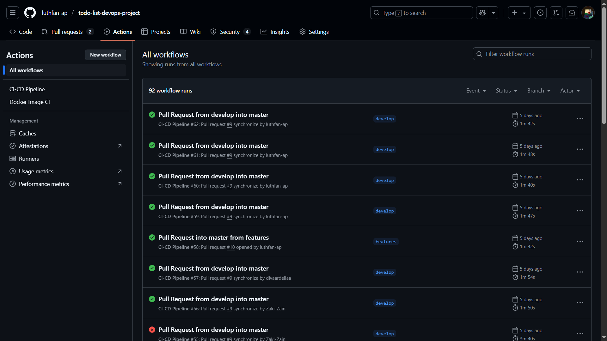

# 📝 Just List It.


## ❔ About:
Just List It is a straightforward web-based to-do list application developed with JavaScript. This project forks an open-source repository [Lordwill1/todo-list](https://github.com/Lordwill1/todo-list).

Its primary goal is to help users to record, manage, and complete their daily tasks. A key feature is that tasks details are stored securely within each user's individual account, including the deadline dates they have set, ensuring personalized and persistent access to their to-do lists.

To ensure rapid and reliable deployments, we implemented CI/CD for the project. It automatically builds the application, runs the unit tests, and deploys the app to the server.

This documentation will overview the project-making process, from forking a github repository until the feature-refinement stage, including the framework and tools used in the project, and also the explanation of the CI/CD Pipeline Workflow itself.

## 👥 Features:
* User Registration & Login
* Personalized to-do list manager
* Themes: Users can choose from several theme options
* Cloud-based storage

## 🛠 Tools Used:
### Tools Overview:
* **Frontend, Backend, and Database:**
   
   [](https://www.javascript.com/)
   [](https://nodejs.org/en)
   [-303030?style=for-the-badge&logo=firebase&logoColor=DD2C00&labelColor=FFFFFF&color=303030&link=https%3A%2F%2Ffirebase.google.com%2F)](https://firebase.google.com/)

* **Version Control:**
   
   [](https://github.com/)
* **CI/CD:**

   [](https://github.com/features/actions)

* **DevOps Supporting Tools:**
   
   [](https://www.docker.com/)
   [](https://jestjs.io/)
   [](https://sonarcloud.io/)
   [](https://discord.com/)
   [![AWS](https://img.shields.io/badge/AWS-orange?style=for-the-badge&labelColor=FFFFFF&logo=data:image/svg%2bxml;base64,PD94bWwgdmVyc2lvbj0iMS4wIiBlbmNvZGluZz0idXRmLTgiPz4NCjwhLS0gR2VuZXJhdG9yOiBBZG9iZSBJbGx1c3RyYXRvciAxOS4wLjEsIFNWRyBFeHBvcnQgUGx1Zy1JbiAuIFNWRyBWZXJzaW9uOiA2LjAwIEJ1aWxkIDApICAtLT4NCjxzdmcgdmVyc2lvbj0iMS4xIiBpZD0iTGF5ZXJfMSIgeG1sbnM9Imh0dHA6Ly93d3cudzMub3JnLzIwMDAvc3ZnIiB4bWxuczp4bGluaz0iaHR0cDovL3d3dy53My5vcmcvMTk5OS94bGluayIgeD0iMHB4IiB5PSIwcHgiDQoJIHZpZXdCb3g9IjAgMCAzMDQgMTgyIiBzdHlsZT0iZW5hYmxlLWJhY2tncm91bmQ6bmV3IDAgMCAzMDQgMTgyOyIgeG1sOnNwYWNlPSJwcmVzZXJ2ZSI+DQo8c3R5bGUgdHlwZT0idGV4dC9jc3MiPg0KCS5zdDB7ZmlsbDojMjUyRjNFO30NCgkuc3Qxe2ZpbGwtcnVsZTpldmVub2RkO2NsaXAtcnVsZTpldmVub2RkO2ZpbGw6I0ZGOTkwMDt9DQo8L3N0eWxlPg0KPGc+DQoJPHBhdGggY2xhc3M9InN0MCIgZD0iTTg2LjQsNjYuNGMwLDMuNywwLjQsNi43LDEuMSw4LjljMC44LDIuMiwxLjgsNC42LDMuMiw3LjJjMC41LDAuOCwwLjcsMS42LDAuNywyLjNjMCwxLTAuNiwyLTEuOSwzbC02LjMsNC4yDQoJCWMtMC45LDAuNi0xLjgsMC45LTIuNiwwLjljLTEsMC0yLTAuNS0zLTEuNEM3Ni4yLDkwLDc1LDg4LjQsNzQsODYuOGMtMS0xLjctMi0zLjYtMy4xLTUuOWMtNy44LDkuMi0xNy42LDEzLjgtMjkuNCwxMy44DQoJCWMtOC40LDAtMTUuMS0yLjQtMjAtNy4yYy00LjktNC44LTcuNC0xMS4yLTcuNC0xOS4yYzAtOC41LDMtMTUuNCw5LjEtMjAuNmM2LjEtNS4yLDE0LjItNy44LDI0LjUtNy44YzMuNCwwLDYuOSwwLjMsMTAuNiwwLjgNCgkJYzMuNywwLjUsNy41LDEuMywxMS41LDIuMnYtNy4zYzAtNy42LTEuNi0xMi45LTQuNy0xNmMtMy4yLTMuMS04LjYtNC42LTE2LjMtNC42Yy0zLjUsMC03LjEsMC40LTEwLjgsMS4zYy0zLjcsMC45LTcuMywyLTEwLjgsMy40DQoJCWMtMS42LDAuNy0yLjgsMS4xLTMuNSwxLjNjLTAuNywwLjItMS4yLDAuMy0xLjYsMC4zYy0xLjQsMC0yLjEtMS0yLjEtMy4xdi00LjljMC0xLjYsMC4yLTIuOCwwLjctMy41YzAuNS0wLjcsMS40LTEuNCwyLjgtMi4xDQoJCWMzLjUtMS44LDcuNy0zLjMsMTIuNi00LjVjNC45LTEuMywxMC4xLTEuOSwxNS42LTEuOWMxMS45LDAsMjAuNiwyLjcsMjYuMiw4LjFjNS41LDUuNCw4LjMsMTMuNiw4LjMsMjQuNlY2Ni40eiBNNDUuOCw4MS42DQoJCWMzLjMsMCw2LjctMC42LDEwLjMtMS44YzMuNi0xLjIsNi44LTMuNCw5LjUtNi40YzEuNi0xLjksMi44LTQsMy40LTYuNGMwLjYtMi40LDEtNS4zLDEtOC43di00LjJjLTIuOS0wLjctNi0xLjMtOS4yLTEuNw0KCQljLTMuMi0wLjQtNi4zLTAuNi05LjQtMC42Yy02LjcsMC0xMS42LDEuMy0xNC45LDRjLTMuMywyLjctNC45LDYuNS00LjksMTEuNWMwLDQuNywxLjIsOC4yLDMuNywxMC42DQoJCUMzNy43LDgwLjQsNDEuMiw4MS42LDQ1LjgsODEuNnogTTEyNi4xLDkyLjRjLTEuOCwwLTMtMC4zLTMuOC0xYy0wLjgtMC42LTEuNS0yLTIuMS0zLjlMOTYuNywxMC4yYy0wLjYtMi0wLjktMy4zLTAuOS00DQoJCWMwLTEuNiwwLjgtMi41LDIuNC0yLjVoOS44YzEuOSwwLDMuMiwwLjMsMy45LDFjMC44LDAuNiwxLjQsMiwyLDMuOWwxNi44LDY2LjJsMTUuNi02Ni4yYzAuNS0yLDEuMS0zLjMsMS45LTMuOWMwLjgtMC42LDIuMi0xLDQtMQ0KCQloOGMxLjksMCwzLjIsMC4zLDQsMWMwLjgsMC42LDEuNSwyLDEuOSwzLjlsMTUuOCw2N2wxNy4zLTY3YzAuNi0yLDEuMy0zLjMsMi0zLjljMC44LTAuNiwyLjEtMSwzLjktMWg5LjNjMS42LDAsMi41LDAuOCwyLjUsMi41DQoJCWMwLDAuNS0wLjEsMS0wLjIsMS42Yy0wLjEsMC42LTAuMywxLjQtMC43LDIuNWwtMjQuMSw3Ny4zYy0wLjYsMi0xLjMsMy4zLTIuMSwzLjljLTAuOCwwLjYtMi4xLDEtMy44LDFoLTguNmMtMS45LDAtMy4yLTAuMy00LTENCgkJYy0wLjgtMC43LTEuNS0yLTEuOS00TDE1NiwyM2wtMTUuNCw2NC40Yy0wLjUsMi0xLjEsMy4zLTEuOSw0Yy0wLjgsMC43LTIuMiwxLTQsMUgxMjYuMXogTTI1NC42LDk1LjFjLTUuMiwwLTEwLjQtMC42LTE1LjQtMS44DQoJCWMtNS0xLjItOC45LTIuNS0xMS41LTRjLTEuNi0wLjktMi43LTEuOS0zLjEtMi44Yy0wLjQtMC45LTAuNi0xLjktMC42LTIuOHYtNS4xYzAtMi4xLDAuOC0zLjEsMi4zLTMuMWMwLjYsMCwxLjIsMC4xLDEuOCwwLjMNCgkJYzAuNiwwLjIsMS41LDAuNiwyLjUsMWMzLjQsMS41LDcuMSwyLjcsMTEsMy41YzQsMC44LDcuOSwxLjIsMTEuOSwxLjJjNi4zLDAsMTEuMi0xLjEsMTQuNi0zLjNjMy40LTIuMiw1LjItNS40LDUuMi05LjUNCgkJYzAtMi44LTAuOS01LjEtMi43LTdjLTEuOC0xLjktNS4yLTMuNi0xMC4xLTUuMkwyNDYsNTJjLTcuMy0yLjMtMTIuNy01LjctMTYtMTAuMmMtMy4zLTQuNC01LTkuMy01LTE0LjVjMC00LjIsMC45LTcuOSwyLjctMTEuMQ0KCQljMS44LTMuMiw0LjItNiw3LjItOC4yYzMtMi4zLDYuNC00LDEwLjQtNS4yYzQtMS4yLDguMi0xLjcsMTIuNi0xLjdjMi4yLDAsNC41LDAuMSw2LjcsMC40YzIuMywwLjMsNC40LDAuNyw2LjUsMS4xDQoJCWMyLDAuNSwzLjksMSw1LjcsMS42YzEuOCwwLjYsMy4yLDEuMiw0LjIsMS44YzEuNCwwLjgsMi40LDEuNiwzLDIuNWMwLjYsMC44LDAuOSwxLjksMC45LDMuM3Y0LjdjMCwyLjEtMC44LDMuMi0yLjMsMy4yDQoJCWMtMC44LDAtMi4xLTAuNC0zLjgtMS4yYy01LjctMi42LTEyLjEtMy45LTE5LjItMy45Yy01LjcsMC0xMC4yLDAuOS0xMy4zLDIuOGMtMy4xLDEuOS00LjcsNC44LTQuNyw4LjljMCwyLjgsMSw1LjIsMyw3LjENCgkJYzIsMS45LDUuNywzLjgsMTEsNS41bDE0LjIsNC41YzcuMiwyLjMsMTIuNCw1LjUsMTUuNSw5LjZjMy4xLDQuMSw0LjYsOC44LDQuNiwxNGMwLDQuMy0wLjksOC4yLTIuNiwxMS42DQoJCWMtMS44LDMuNC00LjIsNi40LTcuMyw4LjhjLTMuMSwyLjUtNi44LDQuMy0xMS4xLDUuNkMyNjQuNCw5NC40LDI1OS43LDk1LjEsMjU0LjYsOTUuMXoiLz4NCgk8Zz4NCgkJPHBhdGggY2xhc3M9InN0MSIgZD0iTTI3My41LDE0My43Yy0zMi45LDI0LjMtODAuNywzNy4yLTEyMS44LDM3LjJjLTU3LjYsMC0xMDkuNS0yMS4zLTE0OC43LTU2LjdjLTMuMS0yLjgtMC4zLTYuNiwzLjQtNC40DQoJCQljNDIuNCwyNC42LDk0LjcsMzkuNSwxNDguOCwzOS41YzM2LjUsMCw3Ni42LTcuNiwxMTMuNS0yMy4yQzI3NC4yLDEzMy42LDI3OC45LDEzOS43LDI3My41LDE0My43eiIvPg0KCQk8cGF0aCBjbGFzcz0ic3QxIiBkPSJNMjg3LjIsMTI4LjFjLTQuMi01LjQtMjcuOC0yLjYtMzguNS0xLjNjLTMuMiwwLjQtMy43LTIuNC0wLjgtNC41YzE4LjgtMTMuMiw0OS43LTkuNCw1My4zLTUNCgkJCWMzLjYsNC41LTEsMzUuNC0xOC42LDUwLjJjLTIuNywyLjMtNS4zLDEuMS00LjEtMS45QzI4Mi41LDE1NS43LDI5MS40LDEzMy40LDI4Ny4yLDEyOC4xeiIvPg0KCTwvZz4NCjwvZz4NCjwvc3ZnPg0K&logoColor=white)](https://discord.com/)

### Github
Github is a web-based platform that uses Git as its version control system to manage source codes and track changes in a software development project.

This is the **master branch** of our Github repository:


And this is the **develop branch** of our Github repository:


### Github Actions
GitHub Actions is an automation feature provided by GitHub for **integrating and managing workflows** in software development. With GitHub Actions, developers can create, run, and automate tasks such as building, testing, deployment, and more, directly from the GitHub repository.

Pipeline Job Content:


Pipeline Execution:


### Docker
Docker is a software that helps in the development and DevOps process for testing or installing application software within isolated "containers" that have their own environments. In its implementation in DevOps, the software application we developed will be built inside a container that has the same environment as production.

The service run on Docker:


The Docker build result:


### Jest
Jest is a popular testing framework for JavaScript applications, primarily used for unit, integration, and end-to-end (E2E) testing in applications built with React, Node.js, and other JavaScript frameworks. Jest was developed by Facebook and is known for its ease of use and advanced features that simplify the testing process.

The jest unit tests are divided into 3 files, which are auth.test.js, main.test.js, and utils.test.js, as in this screenshot:


Our Jest testing result:


### SonarCloud
SonarCloud is a cloud-based SonarQube service used to automatically analyze source code to detect bugs, security vulnerabilities, and improve code quality. By using SonarCloud, our team will receive analytical information about our code quality, as well as suggestions, warnings, and alerts for any errors or bugs in our code.

Here is our SonarCloud analysis result: 


### Firebase
Firebase is a service provided by Google used as a NoSQL database storage. The Firebase features used are Authentication (Login and Register) and Firestore Database (to record the to-do lists for each account).

Firebase Authentication


Firestore Database
<!-- BELOMMMMMMMMMMMMM -->

### Amazon Elastic Container Registry (ECR)
Amazon ECR is an AWS container registry service used to securely store and manage Docker images. In this CI/CD implementation, Docker images will be built and pushed to ECR using GitHub Actions.

Our Amazon ECR repository:
<!-- BELOMMMMMMMMMMMMM -->

### Amazon Elastic Compute Cloud (EC2)
Amazon Elastic Compute Cloud (EC2) is used as a host server to run Docker containers that have been pushed to ECR. The deployment process is automated from the GitHub Actions pipeline using SSH and Docker Compose.

AWS EC2 functions include:
* Serving as the production application host.
* Pulling Docker images from ECR.
* Running containers with Docker Compose.

### Amazon Cloudwatch
Amazon CloudWatch is used to monitor EC2 instance performance in real-time. CloudWatch will record various metrics such as CPU Utilization, Disk IO, and Network Traffic. Additionally, CloudWatch is configured to create alarms when CPU usage exceeds a certain threshold and send notifications via email (SNS).
<!-- BELOMMMMMMMMMMMMM ADA SCREENSHOT DI SINI -->

### Discord Notifications
Discord is used as an automated notification medium for pipeline execution results. Discord webhooks are configured to receive notifications if the pipeline:
* Success -> displaying the commit, branch, and Docker image tag.
* Fails -> displaying the commit, branch, and error status.


## **Getting Started**
To get a copy of "Just List It", follow these simple steps.
### *Prerequisites*:
Before you begin, ensure that you have installed the following in your system:
* Node.js
    * Make sure you have Node.js and npm (Node Package Manager) installed.
    * You can download it from [nodejs.org](nodejs.org).
* Git
    * For cloning the repository
    * You can download it from [git-scm.com](git-scm.com).
* Firebase Project
    * This "Just List It" project uses Firebase Authentication and Firestore.
    * You can build it from [console.firebase.google.com](console.firebase.google.com).

### *Installation*:
1. **Clone the Repository:**
```sh
git clone https://github.com/luthfan-ap/todo-list-devops-project.git
cd todo-list
```
2. **Install Dependencies (with NPM):**
```sh
npm install
```

### *Configuration:*
1. Set up your Firebase Project
   * Go to [Firebase Console](console.firebase.google.com).
   * Click "Create a Firebase Project" and follow the prompts to create a new project.
   * Once created, select your new project from the Firebase dashboard.
2. Register your Web App
   * In your Firebase Console, click the web (“</>”) icon to register a new web app.
   * Enter an app nickname (e.g., "Just List It App"), and click Register app.
   * You will be shown your Firebase SDK config (apiKey, authDomain, etc). Copy this config — you will use it in your project (usually in script.js).
3. Enable Firebase Authentication
   * In your Firebase Console sidebar, go to Build > Authentication.
   * Click "Get started".
   * In the Sign-in method tab, enable Email/Password authentication (or any other methods you want).
   * Save your changes.
4. Enable Firestore Database
   * In the sidebar, click Build > Firestore Database.
   * Click "Create database".
   * Select Start in test mode (recommended for development).
      > You can update security rules for production later.
   * Choose your database location (any is fine for most use cases) and click Next until done.
5. Add Firebase SDKs to your project
   * In your main HTML file (e.g., index.html), add these scripts before your main JavaScript files:
     ```sh
     <!-- Firebase App (core SDK) -->
     <script src="https://www.gstatic.com/firebasejs/10.11.1/firebase-app-compat.js"></script>
     <!-- Firebase Authentication -->
     <script src="https://www.gstatic.com/firebasejs/10.11.1/firebase-auth-compat.js"></script>
     <!-- Firebase Firestore -->
     <script src="https://www.gstatic.com/firebasejs/10.11.1/firebase-firestore-compat.js"></script>
     ```
6. Initialize Firebase in your code
   * In your JavaScript file (e.g., script.js), paste the config you copied earlier:
     ```sh
     const firebaseConfig = {
        apiKey: "YOUR_API_KEY",
        authDomain: "YOUR_PROJECT_ID.firebaseapp.com",
        projectId: "YOUR_PROJECT_ID",
        storageBucket: "YOUR_PROJECT_ID.appspot.com",
        messagingSenderId: "YOUR_SENDER_ID",
        appId: "YOUR_APP_ID"
     };
     // Initialize Firebase
     firebase.initializeApp(firebaseConfig);
     ```
7. Using Authentication and Firestore
   * Use firebase.auth() for authentication methods (register, login, logout, etc).
   * Use firebase.firestore() to read/write to Cloud Firestore.
     ```sh
     const db = firebase.firestore();
     const user = firebase.auth().currentUser;
     
     db.collection("todos").add({
        uid: user.uid,
        text: "My task",
        date: "2024-06-01",
        createdAt: firebase.firestore.FieldValue.serverTimestamp()
     });
     ```

Good luck and happy coding! 🚀

## **CI/CD Pipeline Overview**
This project implemented a Continuous Integration / Continuous Delivery (CI/CD) Pipeline to automate the software delivery process, ensuring a rapid and reliable deployments.

### *Pipeline Workflow*


Our CI/CD pipeline is automatically triggered by several specific events in the git repository:

* **Trigger:** Any *push* to the master branch or a *pull request* from the master branch will trigger the CI/CD Pipeline.
* **Build:**
    * Pulled the repository source codes.
    * Dependencies are installed.
    * The application is built into a production-ready container.
* **Test:**
    * Tests are done using Jest unit tests, which will be executed to the application that has just been built.
    * If any of the tests fail, the pipeline will stop immediately and return an error.
* **AWS Authentication:**
    * Authenticates to your AWS account
* **Push Image to AWS ECR:**
    * The built Docker Image will be pushed into AWS
    * Uses AWS ECR for storing the Docker images
* **Containerization & Deployment:**
    * The built application is dockerized and deployed to the server environment
    * In this project, we use EC2 (Elastic Compute Cloud) as our server infrastructure.
      
### Top contributors:

<a href="https://github.com/luthfan-ap/todo-list-devops-project/graphs/contributors">
  
</a>


<!-- 
## *WEBSITE DEMO*


-->
